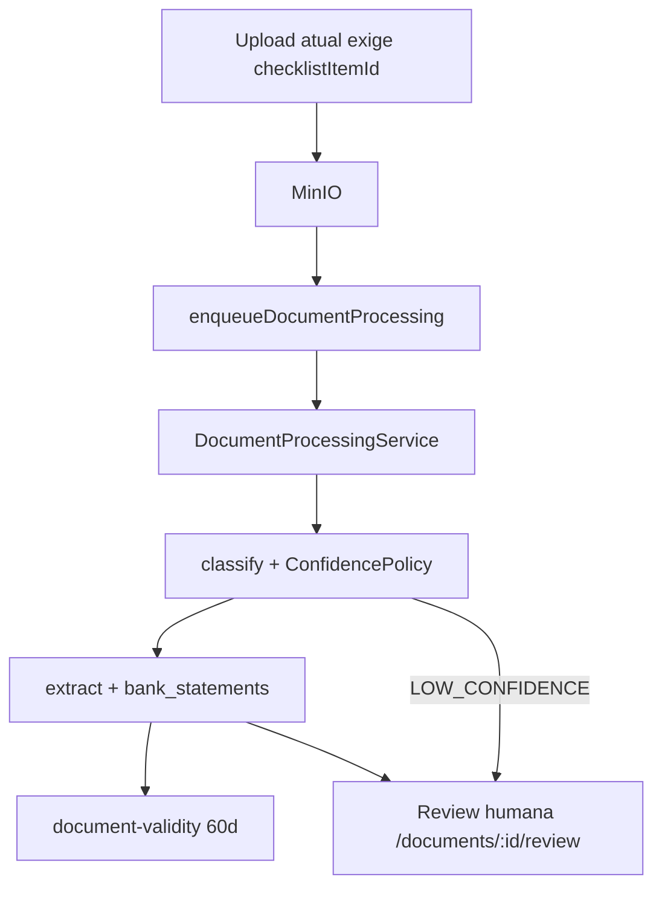
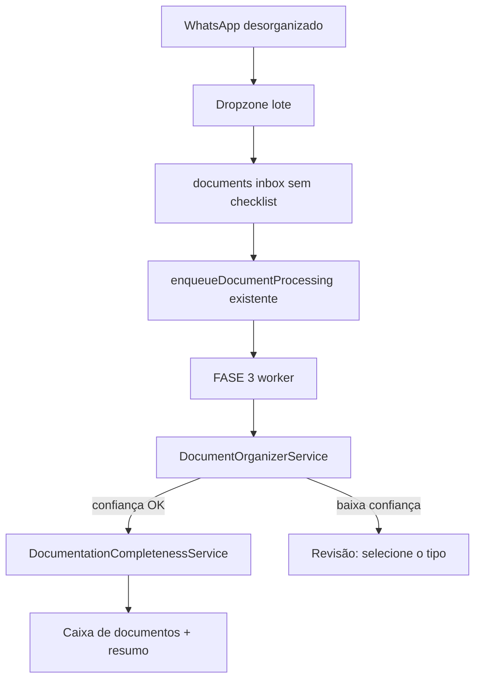

# Caixa de documentos + vínculo CRM (sem FASE 7)

## Princípios (não negociáveis)

- **Não alterar** `src/modules/financing-integrations/**`, correspondentes bancários, submit/track, nem UI de envio institucional.
- **Não criar** outro motor OCR/IA. Reutilizar fila `enqueueDocumentProcessing`, `DocumentProcessingService`, `ConfidencePolicy`, evidências, revisão humana e auditoria.
- **Não refatorar** FASES 1–5 (`document-intelligence`, `financial-analysis`, `credit-decision-support`) além de um gancho mínimo descrito abaixo.
- Envio ao correspondente bancário **continua manual**.
- “DOCUMENTAÇÃO APROVADA PARA ANÁLISE” é **status documental derivado**, não aprovação de crédito e **não** transiciona automaticamente para `APROVADO`.

## O que já existe (reutilizar)

- Upload: [`src/domain/documents/service.ts`](src/domain/documents/service.ts) + [`src/app/api/v1/processes/[id]/documents/route.ts`](src/app/api/v1/processes/[id]/documents/route.ts) — **sempre** exige `checklistItemId`.
- Classificação + limiar: [`ConfidencePolicy.ts`](src/modules/document-intelligence/services/ConfidencePolicy.ts) (`AUTO_SUGGESTED` ≥ 0.90, `REQUIRES_REVIEW` ≥ 0.70, senão `LOW_CONFIDENCE`).
- Mapa de tipos: [`mapToKnownTypeCode`](src/modules/document-intelligence/schemas/classification.ts).
- Extrato já persiste `bankName`, `holderName`, `periodStart`, `periodEnd` em `bank_statements` (FASE 3, sem cálculo de renda).
- Validade de endereço: [`document-validity.ts`](src/domain/documents/document-validity.ts) (60 dias no anexo 5).
- Checklist de anexos Caixa 1–12: [`caixa-annex-catalog.ts`](src/domain/documents/caixa-annex-catalog.ts) — **todos os perfis** recebem os mesmos anexos (`quantity: 1`). Extrato/fatura/contracheque existem como tipos de análise, mas **não entram** no checklist por perfil.
- WhatsApp outbound já existe (FASE 6.5 `NotificationService` + `clients.whatsapp`). **Não há** visita, última interação CRM nem ID de conversa.

## Arquitetura alvo

Novo módulo **`src/modules/document-intake/`** (orquestração + UI). O pipeline FASE 3 permanece o worker.

### 1. Inbox / upload em lote

- Novo POST [`/api/v1/processes/:id/documents/inbox`](src/app/api/v1/processes/[id]/documents/route.ts) (rota irmã): `multipart` com **vários** `files[]`, **sem** `checklistItemId`.
- Persistir em `documents` com tipo placeholder `OUTROS_DOCUMENTOS` (já no catálogo), `checklistItemId = null`, `status = RECEBIDO`, `metadata.intake = "inbox"`.
- Enfileirar o worker **já existente** por arquivo.
- UI dropzone na página do processo: “Arraste a documentação aqui” + contadores (recebidos / processando / organizados / pendências).

Não exigir data no drop em lote; validade de endereço vem da extração (`applyExtractedDocumentValidity` já existe).

### 2. Organização automática (pós-IA)

Novo `DocumentOrganizerService`:

- Lê `document_classifications` + `document_extracted_fields` + `bank_statements`.
- Se `decision === AUTO_SUGGESTED` e tipo conhecido: atualiza `documentTypeId`, vincula ao **item de checklist** correspondente (anexo Caixa ou item de competência `YYYY-MM` para extrato/fatura/contracheque).
- Se `LOW_CONFIDENCE` / tipo não mapeado: **não inventar tipo**. Fica na caixa “Documento não identificado — selecione o tipo” (reusa revisão humana; PATCH de tipo + reprocess opcional já existente).

**Único toque permitido em FASE 3:** em [`DocumentProcessingService.ts`](src/modules/document-intelligence/services/DocumentProcessingService.ts), `UNKNOWN_DOCUMENT_TYPE` hoje **quebra** o run. Alinhar ao caminho já existente de `LOW_CONFIDENCE` → `REQUIRES_REVIEW` (sem mudar OCR, prompts, extract, consistência). Sem isso o inbox falha em vez de ir para revisão.

Não auto-marcar `VALIDADO` (regra FASE 3: COMPLETED ≠ VALIDADO). Organização = tipo + pasta do checklist; validação humana permanece.

### 3. Completude por perfil (overlay, sem substituir anexos Caixa)

Manter anexos 1–12. **Acrescentar** requisitos de análise em [`catalog.ts`](src/domain/documents/catalog.ts) (additive, sem apagar Caixa):

- **AUTÔNOMO:** 3 competências `EXTRATO_BANCARIO` (últimos 3 meses) + 3 `FATURA_CARTAO` condicional (`HAS_CREDIT_CARD`, já existe).
- **CLT:** 2 competências `CONTRACHEQUE`.
- Demais perfis: não expandir nesta etapa além do que o catálogo Caixa já cobre.

`DocumentationCompletenessService` (novo, puro + SQL de leitura):

- Mapa visual por categoria (Identificação, Endereço, Renda, Cartão).
- Extratos: cruzar `period_end` / competência vs jan/fev/mar relativos a “hoje”.
- Resultado: `EXTRATOS BANCÁRIOS — COMPLETO` ou `PENDÊNCIA — Falta extrato de {mês}` via [`upsertAutomaticPendency`](src/domain/pendencies/service.ts) (tipo novo `MISSING_PERIOD`, idempotente).
- Validade: reutilizar `expired` / `EXPIRADO` do comprovante de endereço.
- Ilegível: já coberto por consistência / revisão; exibir ⚠ no resumo.
- E-mail e telefone: **campos do cliente** (`clients.email`, `clients.phone`/`whatsapp`), não documentos — entram no resumo de atendimento/completude de cadastro.

Status documental derivado:

- `INCOMPLETA` | `AGUARDANDO_REVISAO` | `APROVADA_PARA_ANALISE`

Só `APROVADA_PARA_ANALISE` quando obrigatórios do perfil + anexos Caixa obrigatórios estão presentes, não expirados, e sem LOW_CONFIDENCE pendente. Copy na UI: *não é aprovação de crédito*.

### 4. UI

Novo painel [`ProcessDocumentInboxPanel`](src/components/process-document-inbox-panel.tsx) na página do processo, **acima** de [`ProcessDocumentsPanel`](src/components/process-documents-panel.tsx):

- Dropzone lote
- Contadores
- Lista “não identificados”
- Resumo visual ✓/⚠
- Depois o checklist organizado já existente (não reescrever o painel de anexos; só complementar)

### 5. CRM / WhatsApp — só estrutura

Não criar plataforma de chat.

Nova tabela `process_attendance` (tenant + process unique):

- `external_conversation_id` (nullable — ID do CRM existente)
- `last_interaction_at`
- `next_visit_at`
- `next_visit_location`
- `notes`
- timestamps

API `GET/PATCH /api/v1/processes/:id/attendance` (`processes:write`).

Painel **Atendimento**: cliente, WhatsApp (de `clients`), última interação (attendance ou última `notifications` WHATSAPP), próxima visita, local, observações.

Stub de vínculo: campo `external_conversation_id` + auditoria. Sem webhook WhatsApp nesta etapa.

## Fora de escopo

- Envio automático ao correspondente/banco
- Ranking/escolha de correspondente
- Novo OCR, novos prompts estruturais (salvo se o mock já não devolver período — aí só fixture de teste)
- Auto-transição da máquina de status do processo para `APROVADO` / `DOCUMENTACAO_RECEBIDA`
- FASE 7.1

## Testes obrigatórios

- Upload lote: N arquivos, N linhas `documents`, N jobs
- Sem `checklistItemId` no inbox
- Organização com confiança alta → item certo
- Confiança baixa → não classifica sozinho
- Dois extratos + um mês faltando → pendência de período
- Três meses → COMPLETO
- Comprovante expirado → ⚠ validade
- Isolamento tenant / RBAC `documents:write`
- Attendance PATCH sem cross-tenant

## Docs

Atualizar [`docs/DOCUMENT_INTELLIGENCE.md`](docs/DOCUMENT_INTELLIGENCE.md) (consumo, não freeze break), [`docs/OPERATIONS.md`](docs/OPERATIONS.md) (incremento 6.7 intake + CRM link), [`docs/API.md`](docs/API.md), [`docs/DATABASE.md`](docs/DATABASE.md). **Não** editar [`docs/FINANCING_INTEGRATIONS.md`](docs/FINANCING_INTEGRATIONS.md) além de uma linha “intake não envia ao banco”.
