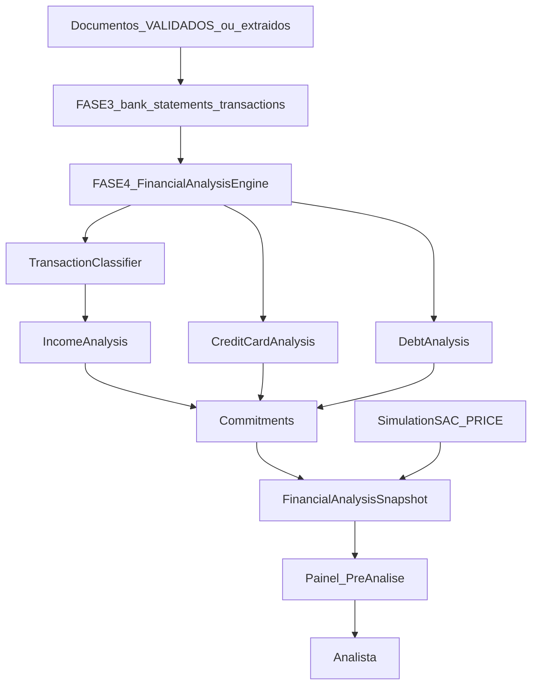

# FASE 3 Baseline + FASE 4 Financial Analysis

## Governança (primeiro passo, antes de qualquer código financeiro)

Criar [`docs/PHASES.md`](docs/PHASES.md) e marcar:

- **FASE 3 — Document Intelligence: `PRODUCTION CLOSED`**
  - 23 testes passando (baseline)
  - Migration `0002_*` aplicada
  - Worker / Mock OCR / Mock AI / Human-in-the-loop / Auditoria funcionais
  - Regra de freeze: mudanças em `src/modules/document-intelligence/**` só para bugfix crítico; evolução financeira fica em módulo novo
- **FASE 4 — Financial Analysis: `IN PROGRESS`**

Atualizar status em [`README.md`](README.md) e nota de freeze em [`docs/DOCUMENT_INTELLIGENCE.md`](docs/DOCUMENT_INTELLIGENCE.md).

## Princípios (não negociáveis)

- FASE 4 **lê** `bank_statements` / `bank_transactions` / campos extraídos; **não** reescreve o pipeline OCR/IA.
- Nunca somar créditos brutos como renda.
- Nunca aprovar/reprovar crédito bancário; sempre disclaimer de pré-análise interna.
- `documents.status` e `document_processing_runs` permanecem intactos semanticamente.
- Persistir metodologia e evidência do cálculo (categorias excluídas, meses, média, mediana, confiança).

## Default metodológico (renda bancária)

Para cada mês de extrato:

```text
créditos totais
− transferências próprias
− empréstimos / TED crédito
− estornos
= créditos potencialmente válidos (mês)
```

Agregado multi-mês: gravar **média**, **mediana**, variação e recorrência.  
**Renda analisada padrão (`analyzedIncome`) = mediana** dos créditos válidos mensais (mais defensável contra outliers). Média e min/max ficam no snapshot para o analista.

## Arquitetura



Novo módulo: `src/modules/financial-analysis/` (espelha o padrão de document-intelligence).

Reutilizar campos já existentes em [`src/db/schema/index.ts`](src/db/schema/index.ts):
- `clients.declaredIncome`, `fgtsBalance`, `downPaymentAvailable`
- `financingProcesses.propertyValue`, `downPayment`, `financedAmount`, `fgtsAmount`, `amortizationSystem`, `analyzedIncome`, `paymentCapacity`
- `bank_transactions.category` (hoje mock: `INCOME_PROBABLE`, `CARD_PAYMENT`, `UNKNOWN`)

## Schema novo (FASE 4.1)

| Tabela | Função |
|--------|--------|
| `financial_analyses` | 1 run por processo (versionável); status; disclaimer; scores |
| `income_month_rolls` | por mês: gross credits, exclusions, valid credits |
| `income_analyses` | declared, estimated (median), mean, variation, recurrence, confidence, method_version |
| `transaction_classifications` | override humano/auditoria da categoria por `bank_transaction_id` |
| `credit_card_analyses` | limite, fatura, parcelamentos, comprometimento mensal |
| `debts` | empréstimos/financiamentos/outras obrigações (manual + extraído) |
| `financial_commitments` | aluguel + consolidado de dívidas/cartões |
| `financing_simulations` | imóvel, entrada, FGTS, prazo, taxa, SAC/PRICE, parcela |
| `payment_capacity_snapshots` | renda − compromissos; % comprometimento; indicativo |

Categorias canônicas de lançamento:

`INCOME_PROBABLE | SALARY | OWN_TRANSFER | LOAN | REFUND | CARD_PAYMENT | EXPENSE | FEE | UNKNOWN`

## Ordem de implementação

### 4.0 — Baseline FASE 3
Docs de freeze + checklist.

### 4.1 — Schema + migrations
Drizzle + `pnpm db:generate` / `db:migrate`. Sem alterar enums/tabelas da FASE 3 além de leitura.

### 4.2 — Transaction Classification Engine
Heurísticas determinísticas sobre `description` + direção (regras versionadas em código, ex. `classifier/rules-v1.ts`).  
Permite override humano via API. Atualiza/espelha categoria em `bank_transactions` quando confiante.

### 4.3 — Income Analysis
Agrega por `period_start/end` dos extratos do processo; aplica exclusões; calcula média/mediana/variação/confiança; persiste rolls.  
Testes unitários com o exemplo Maio (8750 − 2000 − 1500 − 300 = 4950).

### 4.4 — Credit Card + Debt + Commitments
Extrair/agregar de faturas e campos manuais; consolidar obrigações; calcular capacidade estimada.

### 4.5 — Simulation Engine (SAC / PRICE)
Funções puras + testes (parcela, saldo, tabela resumida). Inputs do processo + override na UI.

### 4.6 — Financial Analysis orchestrator + fila
`POST /api/v1/processes/:id/financial-analysis` (`sync` | `enqueue`).  
Worker em `financial-analysis` ([`src/infra/queues.ts`](src/infra/queues.ts) já reserva o nome).  
Atualiza `financing_processes.analyzedIncome` e `paymentCapacity` como cache do último snapshot.

### 4.7 — API + UI de pré-análise
Painel no processo: renda declarada vs analisada, exclusões, meses, dívidas, cartões, simulação, indicativo (`FAVORAVEL | NECESSITA_ANALISE | DESFAVORAVEL`) com thresholds internos documentados — **nunca** “aprovado/reprovado pelo banco”.

### 4.8 — Testes + docs
`docs/FINANCIAL_ANALYSIS.md`, atualizar API/ARCHITECTURE/DATABASE/TESTING; testes do classificador, renda, SAC/PRICE, disclaimer.

## Indicativo interno (thresholds iniciais)

Com base em `% comprometimento = parcela_simulada / renda_analisada` (e flags de inconsistência):

- `FAVORAVEL`: comprometimento ≤ 30% e sem mismatches críticos
- `NECESSITA_ANALISE`: 30–40% ou baixa confiança / poucos meses
- `DESFAVORAVEL`: > 40% ou renda inválida / sem extratos

Sempre texto fixo: *“Resultado de pré-análise interna. Não representa aprovação ou reprovação de crédito por instituição financeira.”*

## Fronteira com FASE 3 (freeze)

Não mover lógica financeira para dentro de `DocumentProcessingService`.  
Extrato na FASE 3 continua só extraindo; FASE 4 é quem interpreta renda.

## Fora de escopo desta fase

- Rule Engine versionado em DB (FASE 5)
- Parecer formal / PDF (FASE 6)
- Integração bancária real / bureau
