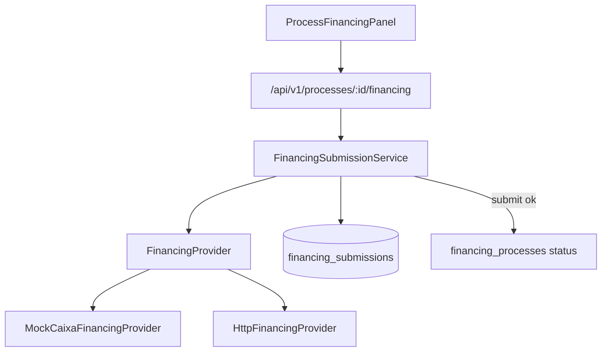

# FASE 7 — Institutional Financing Integrations

## Decisões fixas (baseline v1)

- Novo módulo: [`src/modules/financing-integrations/`](src/modules/financing-integrations/) (fora do freeze de `operations/**`).
- Padrão igual à 6.6: interface `FinancingProvider` + `mock` | `http` via `FINANCING_PROVIDER`.
- Instituição inicial: código `CAIXA` (multi-banco = novos adapters depois).
- Payload de envio: **metadados do processo** (número, cliente mascarado, valores, checklist %, ref do último dossiê/parecer) — **sem** upload binário de documentos nesta versão.
- Gate de submit: status `APTO` ou `AGUARDANDO_BANCO`.
- Sucesso no submit → transição automática para `ENVIADO_AO_BANCO` (já prevista na máquina em [`status-machine.ts`](src/domain/process/status-machine.ts)).
- Track (consulta de status) atualiza a submissão; mapeamento institucional `APROVADO` / `REPROVADO` só via ação explícita do analista na UI (não auto-transicionar no mock sem confirmação humana).

## Arquitetura

## Persistência

Nova tabela `financing_submissions` (migration `0011_...`):

- `tenant_id`, `process_id`, `institution` (`CAIXA` …)
- `provider`, `status` (`QUEUED` | `SUBMITTED` | `TRACKING` | `SUCCEEDED` | `FAILED` | `CANCELLED`)
- `provider_ref`, `request_summary`, `response_summary`, `external_status`, `error_message`
- `submitted_by_user_id`, `submitted_at`, `last_tracked_at`, timestamps
- índices por tenant/process/institution

Schema em [`src/db/schema/index.ts`](src/db/schema/index.ts).

## Provider

[`FinancingProvider.ts`](src/modules/financing-integrations/FinancingProvider.ts):

- `submit(input)` → `{ ok, providerRef, externalStatus?, summary, errorMessage? }`
- `track(input)` → mesmo shape com status externo simulado

Providers em `providers.ts`:

- `MockCaixaFinancingProvider` — ref `mock-caixa-{ts}`, status externo `EM_ANALISE_INSTITUICAO`
- `HttpFinancingProvider` — POST em `FINANCING_PROVIDER_URL` (+ token); sem URL → `skipped` como na 6.6

Env: `FINANCING_PROVIDER=mock|http`, `FINANCING_PROVIDER_URL`, `FINANCING_PROVIDER_TOKEN`.

## Domínio / serviço

[`FinancingSubmissionService.ts`](src/modules/financing-integrations/FinancingSubmissionService.ts):

- `submitProcessFinancing(session, processId, { institution })`
  - valida permissão + status gate
  - monta summary redacted (cpfLast4, sem dump de docs)
  - persiste `QUEUED` → chama provider → `SUBMITTED`/`FAILED`
  - se ok: `transitionProcess` → `ENVIADO_AO_BANCO`
  - audit log `FINANCING_SUBMIT`
- `trackProcessFinancing(session, processId, submissionId?)`
- `listProcessFinancing(session, processId)`

Permissões novas: `financing:read` / `financing:write` para `ADMIN`, `GESTOR`, `ANALISTA` em [`permissions.ts`](src/domain/rbac/permissions.ts).

## API + UI

- `GET/POST /api/v1/processes/:id/financing` — listar / submit `{ institution: "CAIXA" }`
- `POST /api/v1/processes/:id/financing/:submissionId/track` — acompanhar

UI: painel `ProcessFinancingPanel` na página do processo ([`processes/[id]/page.tsx`](src/app/(app)/processes/[id]/page.tsx)), separado do painel de leitura 6.6:

- botão “Enviar à Caixa (mock)”
- histórico de submissões + status externo
- botão “Atualizar status”
- disclaimer: Zion não aprova crédito; retorno institucional é indicativo até confirmação humana

## Docs + testes

- Atualizar [`docs/PHASES.md`](docs/PHASES.md), [`docs/OPERATIONS.md`](docs/OPERATIONS.md) (ponteiro FASE 7), [`docs/API.md`](docs/API.md), [`docs/ARCHITECTURE.md`](docs/ARCHITECTURE.md), [`README.md`](README.md)
- Novo `docs/FINANCING_INTEGRATIONS.md` (baseline curto)
- Testes: provider mock + gate de status + mapeamento de permissões

## Fora de escopo (v1)

- SDK real Caixa / autenticação bancária
- Envio de PDFs/binários ao banco
- Auto-transição para `APROVADO`/`REPROVADO` sem analista
- Alterações em FASES 3–5 / freeze de `operations/**` (só referência cruzada)